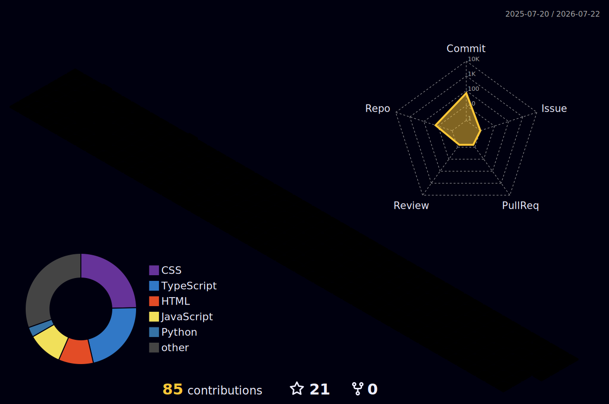

## `Estudando Atualmente` &nbsp; <sub>📅 estudando em: 27/02/2025</sub>

<div align="center">

[](https://git.io/typing-svg)

</div>

```c
[semana de 27/02/2025]

→ Ponteiros para ponteiros em C
→ Alocação dinâmica
→ Java OOP

> Atualizo esta seção toda semana.
> Se estiver desatualizada, estou com a cabeça enterrada em algum manual.
```

---

## `$ cat bookshelf.md`

_Livros que estão na mesa agora_

<div align="center">

| 📖 Livro | ✍️ Autor | 📍 Status |
|---|---|---|
| Clean Code | Robert C. Martin | `lendo` |

</div>

> _"Qualquer um pode escrever código que um computador entenda. Poucos escrevem código que humanos entendam."_

---

## `$ cat stack.txt`

<div align="center">

### Linguagens


<br>

### Compiladores & Build


<br>

### Editores & IDEs


<br>

### Versionamento


</div>

---

## `$ cat roadmap.md`

```txt
[✓] Desenvolvimento Web — HTML, CSS, JS
[✓] Lógica de programação e algoritmos básicos
[→] C — ponteiros, memória, estruturas
[→] Java — orientação a objetos, fundamentos
[→] Ambiente Unix/Linux, filosofia, shell, ferramentas
[ ] Sistemas Embarcados, microcontroladores, bare-metal
[ ] Estruturas de Dados e Algoritmos avançados
[ ] Arquitetura de Computadores
[ ] Sistemas Operacionais, internals de verdade
[ ] Pesquisa Acadêmica
```

---

## `$ git log --stats`

<div align="center">


</div>

<div align="center">


</div>

---

## `$ render --3d activity`

<div align="center">



</div>

---

<div align="center">

[](https://git.io/typing-svg)

</div>

---

<div align="center">


</div>

<div align="center">


</div>
